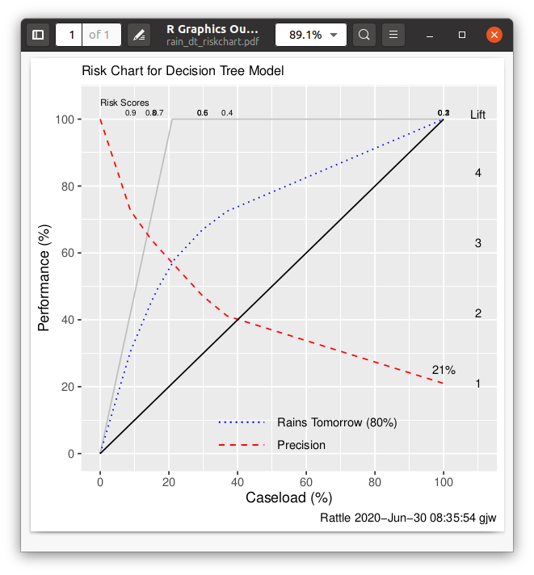

Decision Tree Models: Predicting Rain Tomorrow
==============================================

This [MLHub](https://mlhub.ai) package uses the weatherAUS dataset
from R's [Rattle](https://rattle.togaware.com) package to train a
predictive model for the probability of it raining tomorrow based on
today's weather observations. The training dataset consists of daily
weather observations from weather stations across Australia capturing
the amount of sunshine, the humidity, the amount of rain today,
etc. This simplest of approaches uses the decision tree induction
algorithm to build a model that is represented as a decision
tree. Other (often more accurate but more complex) models include the
random forest which builds a forest (i.e., a collection) of decision
trees and produces an ensemble type model
([rainrf](https://github.com/gjwgit/rain/docs/blob/master/rainrf.md)).
Ensembles have been shown over many years to produce more accurate
models (see, for example, the original work on [multiple inductive
learning](http://togaware.com/papers/milai87.pdf)).

These models come from the Essentials of Data Science by Graham
Williams <https://bit.ly/essentials_data_science>. Further support
material is also available from <https://essentials.togaware.com/>.

Visit the github repository for more details:
<https://github.com/gjwgit/rain>

Usage
-----

- To install mlhub (Ubuntu 18.04 LTS):

```console
$ pip3 install mlhub
$ ml configure
```

- To install and configure the demo:

```console
$ ml install rain
$ ml configure rain
$ ml demo rain
```

Demonstration
-------------

```console
==============================================
Model to Predict Rain Tomorrow - Decision Tree
==============================================

This prebuilt decision tree based model illustrates the simplicity with which
AI models can be built from historic data and deployed to provide some degree
of accuracy in their prediction. The model here is based on a dataset from a
collection of weather observations at different locations over several years.
How well it performs is dependent on the training data and the locations at
which the model is to be deployed.

The purpose here is to illustrate the process of reviewing the performance
of the pre-built model. You might find it useful to review MLHub's rainrf
model too, which provides a pre-built random forest which is considerably
more accurate than this model.

Press Enter to continue: 

=====================
Predict Rain Tomorrow
=====================

Below we show the predictions, that are being computed right now. The
pre-built decision tree model is being applied to a random subset of a
dataset of previously unseen daily observations.

This provides an insight into the performance of the model. The performance
here is just okay based on this datasate. Note the highlighted errors. No
model is perfect.

   Actual Predicted Error
1     Yes        No <----
2      No        No      
3      No       Yes <----
4      No        No      
5     Yes        No <----
6      No        No      
7      No        No      
8      No       Yes <----
9     Yes        No <----
10    Yes       Yes      
11    Yes       Yes      
12    Yes       Yes      

Press Enter to continue: 

====================
Actual Decision Tree
====================

We often want to gain insight into the models that the artificial intelligence
builds. Below is a text representation of the decision tree model that the
decision tree algorithm has built based on the training data provided to the
algorithm.

The first line reports the number of observations in the training dataset.
The line begining with 'node)' is a legend. Split is a test condition, n is the
number of observations that have made there way to this node, the loss is the
error in the prediction at this node, the yval the majority class (i.e., the
prediction), and yprob is class probability.

n=142240 (3223 observations deleted due to missingness)

node), split, n, loss, yval, (yprob)
      * denotes terminal node

 1) root 142240 56896.000 No (0.6000000 0.4000000)  
   2) humidity_3pm< 66.5 109682 25059.510 No (0.7463961 0.2536039)  
     4) sunshine>=8.45 68966  9550.036 No (0.8368809 0.1631191) *
     5) sunshine< 8.45 40716 15509.480 No (0.6148357 0.3851643)  
      10) pressure_3pm>=1013.55 27838  7079.226 No (0.7223274 0.2776726) *
      11) pressure_3pm< 1013.55 12878  6342.054 Yes (0.4293206 0.5706794)  
        22) humidity_3pm< 46.5 5018  2239.570 No (0.5653211 0.4346789) *
        23) humidity_3pm>=46.5 7860  3429.384 Yes (0.3564824 0.6435176) *
   3) humidity_3pm>=66.5 32558 11589.940 Yes (0.2668867 0.7331133) *

Press Enter to continue: 

====================
Visual Decision Tree
====================

A visual representation of a model can often be more insightful
than the printed textual representation. For a decision tree
model, representing the discovered knowledge as a decision tree, we
read the tree from top to bottom, traversing the path corresponding
to the answer to the question presented at each node. The leaf node
has the final decision together with the class probabilities.

Press Enter to continue: 

Close the graphic window using Ctrl-w.
```


```console
Press Enter to continue: 

===================
Variable Importance
===================

One aspect of understanding the data and models that we build is what
variables play the most significant role in predicting the outcome.

We first list the variables that are actually found by the algorithm
to be effective in the model. Then we list all the variables and report
their relative importance in predicting the outcome.

When you press the Enter key below, a plot of the same data is presented.
A visual presentation can often be more effective.

Variables Used:  humidity_3pm, pressure_3pm, sunshine.

Relative Importance of Variables:

humidity_3pm     sunshine     temp_3pm     max_temp pressure_3pm humidity_9am 
          56           10            7            6            6            5 
pressure_9am    cloud_9am     rainfall     temp_9am     min_temp 
           4            2            1            1            1 

Press Enter to continue: 

Close the graphic window using Ctrl-w.
```


```console

Press Enter to continue: 

==================
Variable Selection
==================

When the model was built, the algorithm chooses a variable for each node
of the resulting decision tree. An entropy, information theory or gini
based calculation is performed to choose the variable. The variable with
the highest value according to this measure is chosen for the particular
node.

Below we can see the calculations that were made for the root node of the
tree (Node Number 1).

Press Enter to continue: 

Node number 1: 142240 observations,    complexity param=0.3559
  predicted class=No   expected loss=0.4  P(node) =1
    class counts: 110992 31248
   probabilities: 0.600 0.400 
  left son=2 (109682 obs) right son=3 (32558 obs)
  Primary splits:
      humidity_3pm < 66.5  to the left,  improve=13900, (3568 missing)
      rainfall     < 0.35  to the left,  improve= 8792, (1410 missing)
      rain_today   splits as  LR,        improve= 8388, (1410 missing)
      sunshine     < 7.75  to the right, improve= 7628, (68769 missing)
      cloud_3pm    < 5.5   to the left,  improve= 6538, (58180 missing)
  Surrogate splits:
      temp_3pm     < 11.95 to the right, agree=0.786, adj=0.075, (826 split)
      humidity_9am < 90.5  to the left,  agree=0.783, adj=0.059, (2317 split)
      max_temp     < 12.55 to the right, agree=0.779, adj=0.046, (340 split)
      rainfall     < 6.05  to the left,  agree=0.774, adj=0.022, (80 split)

Press Enter to continue: 

```console
Press Enter to continue: 

================
Confusion Matrix
================

A confusion matrix summarises the performance of the model on this evluation
dataset. All figures in the table are percentages and are calculated across
the predicitions made by the model for each observation and compared to the
actual or known values of the target variable. The first column reports the
true negative and false negative rates whilst the second column reports the
false positive and true positive rates.

The Error column calculates the error across each class. We also report the
overall error which is calculated as the number of errors over the number of
observations. The average of the class errors is also reported. 

      Predicted
Actual No Yes Error
   No  30  20    40
   Yes 20  30    40

Overall error: 40%
Average class error: 40%

Press Enter to continue: 

==========
Risk Chart
==========

A risk chart presents a cumulative performance view of the model.

The x-axis is the days sorted (left to right) from the highest probability
of rain tomorrow to the lowest probability of rain tomorrow.

The y-axis is the expected performance of the model in predicting rain. It is
the percentage of the known days on which it rains that are predicted by the
model for thected performance of the model in predicting rain. It is
the percentage of the known days on which it rains that are predicted by the
model for the given recall (x-axis).

The more area under the curve the better the model performance. A perfect
model would follow the grey line. The Precision line represents
the lift offered by the model, with the lift values on the right hand axis.

Close the graphic window using Ctrl-w.
```


